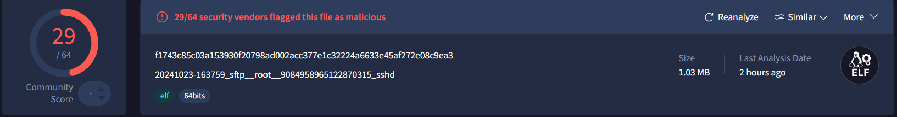
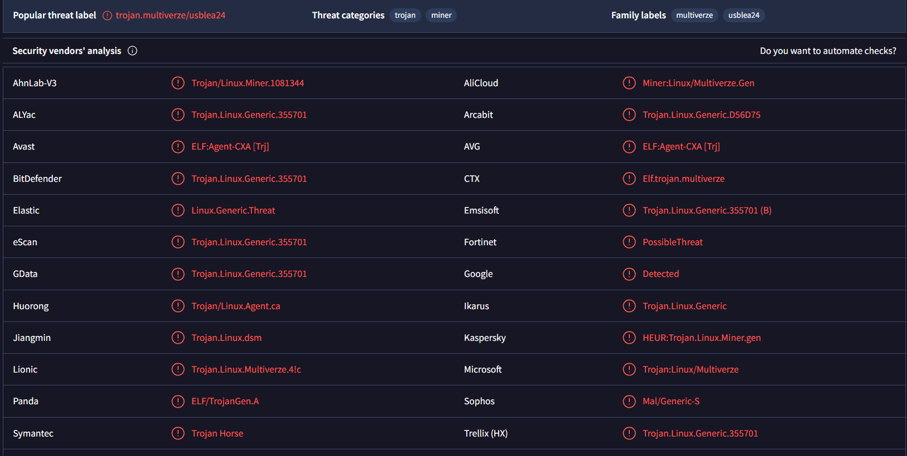

# New Year, New Ways to Brick your Machine
Good Morning! Bonjour! Guten Tag! It is the first day of 2025 at 1:32 AM EST (GMT-5) and I am having the time of my life finding new trojans on the internet.

## Background
So I found a great [video](https://www.youtube.com/watch?v=ASIEN3qmaNg) by [GnarCoding](https://www.youtube.com/@GnarCoding) one day where he went over the basics of creating a honey pot with Cowrie, and I was like, *hey, I could totally do that!* So here I am. 

## Creating a VM on Microsoft Azure
So I decided to use a VM on Azure for two reasons. One, I get 100 doubloons worth of free hosting (yay) and you get a VM as a free service for some hundreds of hours, so you only end up paying for the storage costs (I'm currently sitting at ~30 cents charged?). Two, I think it's important to learn cloud services and how they work (duh).

I set up the Linux VM on the Azure platform and was off to the races. 

## Cowrie
Cowrie is a honeypot written in python that lets you customize quite a bit. Unfortunately, most computers trying to ssh into your machine are just bots, so you can't have too much fun pwning the n00bs. Booting Cowrie is as simple as one-two-buckle your shoe. I followed the getting started section to a T, and got it working quickly. 
From there, it was a simple matter of logging attempts to get into the server and grab the payloads of the viruses. Cowrie makes this very simple, just navigate to 
```
 cowrie/var/lib/cowrie/downloads
```
and grab the payload.
Using [VirusTotal](virustotal.com) we can safely analyze the payload. I had to upload the zipped version since Windows Defender just wipes it from your system as soon as it finds the raw ```.elf```. Which is a good thing, but in the moment was kind of annoying ~~**LET ME DO DANGEROUS THINGS *WILLIAM*.**~~

## Payload Analysis
Full analysis available at [this](https://www.virustotal.com/gui/file/f1743c85c03a153930f20798ad002acc377e1c32224a6633e45af272e08c9ea3) link! 


~*oof*~

Looks like a standard crypto miner + trojan, which makes sense given that they're looking to upload them onto vulnerable devices through ssh. One of these days I'll try to extract the actual payload with some sort of decompiler and try to see how the meat and potatoes works. But that day is not today! If you would like to see the json of the report it is in the report.json. I am great at naming things. 

